# Data model

The schema, the rules the database itself enforces, and the ways data gets in and out.

Postgres 16 in every real deployment (`docker compose up`). SQLite works for local development
without Docker, minus the Postgres-only guarantees marked **(pg)** below (triggers and an exclusion
constraint); the service layer enforces the same rules there.

## Entity relationships

```mermaid
erDiagram
    User ||--o{ ApiToken : "issues"
    User ||--o{ UserSession : "is logged in as"
    User ||--o{ EventMembership : "holds a role in"
    User ||--o{ TeamMember : "is on"
    User ||--o{ AuditLog : "acts in"

    Event ||--o{ EventMembership : "grants roles"
    Event ||--o{ Track : "has"
    Event ||--o{ Prize : "offers"
    Event ||--o{ CustomQuestion : "asks"
    Event ||--o{ Team : "hosts"
    Event ||--o{ Project : "receives"
    Event ||--o{ Criterion : "is scored by"

    EventMembership ||--o{ JudgeTrack : "covers"
    Track ||--o{ JudgeTrack : "is covered by"
    EventMembership ||--o{ Score : "gives (judge)"
    EventMembership ||--o{ Assignment : "is asked (judge)"
    Project ||--o{ Assignment : "is assigned in"
    AssignmentRound ||--o{ Assignment : "created"
    Event ||--o{ AssignmentRound : "runs"
    Event ||--o{ JudgeInvite : "invites"

    Team ||--o{ TeamMember : "has"
    Team ||--o| TeamExtension : "may have"
    Team ||--|| Project : "owns one"

    Track ||--o{ Project : "categorises"
    Project ||--o{ ProjectImage : "shows"
    Project }o--o{ Tag : "tagged"
    Project ||--o{ Answer : "answers"
    CustomQuestion ||--o{ Answer : "is answered by"
    Project ||--o{ Score : "is reviewed in"

    Criterion ||--o{ ScoreItem : "is scored in"
    Score ||--o{ ScoreItem : "contains"

    Event ||--o{ ResultSnapshot : "is ranked in"
    Event ||--o| EventResultSettings : "shows results as"
    ResultSnapshot ||--o{ Publication : "is published by"
    Event ||--o| VotingConfig : "may hold a vote"
    Event ||--o{ VoterLink : "allowlists"
    Event ||--o{ Ballot : "collects"
    User ||--o{ Ballot : "casts (logged in)"
    VoterLink ||--o| Ballot : "casts (by link)"
    Ballot ||--o{ BallotLine : "places credits"
    Project ||--o{ BallotLine : "receives credits"
    Event ||--o{ VoteTallySnapshot : "freezes"
    VoteTallySnapshot ||--o{ ResultSnapshot : "is used by (final)"
```

## The central decision: roles are per event

There is no global "is a judge" column. `EventMembership(user, event, role)` says this person is a
**participant**, **judge** or **organizer** *of this event*. The same person can judge one hackathon
and compete in the next, and an organizer's powers stop at the edge of their own events. The only
platform-wide facts are two flags on `User`: `is_platform_admin` and `can_create_events`.

The **conflict-of-interest rule**, nobody is both a competitor and staff in one event, lives in the
database:

- `EventMembership.side` is a **stored generated column** (`competitor` for participant, `staff` for
  judge and organizer), computed by Postgres, not by Python.
- The exclusion constraint `membership_no_competitor_and_staff` **(pg)** says no two rows for the same
  `(user, event)` may disagree about `side`. A CHECK cannot express that (it depends on other rows),
  and a unique index cannot either (judge + organizer together is allowed). It needs the `btree_gist`
  extension, which ships with Postgres; `events/migrations/0002_membership_conflict_of_interest.py`
  creates both.

A participant membership exists exactly while the person is on a team in that event: the team
services create it on create/join and remove it on leave, removal or disband. That is the design's
"implicit registration" (joining a team registers you).

This is the one place the merged portal departs from the portal-v2 design document, which chose one
role per account. The portals, URLs and refusals are unchanged; see [ARCHITECTURE.md](ARCHITECTURE.md).

## Tables

### accounts

| Table | Holds | Enforced by the database |
|---|---|---|
| `accounts_user` | email (login), name, `is_platform_admin`, `can_create_events`, Argon2id hash | `user_email_ci_unique` on `lower(email)` |
| `accounts_apitoken` | Bearer tokens: name, 8-char prefix, **SHA-256 digest only**, last used, revoked | `digest` unique |
| `accounts_usersession` | one row per logged-in browser: session key, **IP hash** (never the address), user agent, last seen | `session_key` unique |

### events

| Table | Holds | Enforced by the database |
|---|---|---|
| `events_event` | slug, name, tagline, Markdown description, `starts_at`, `submissions_open_at`, `submissions_close_at`, `original_submissions_close_at`, `judging_starts_at`, `judging_ends_at`, `original_judging_ends_at`, `results_at` (null = to be announced), min/max team size, `is_published` | a strictly ordered timeline, one CHECK per step: `event_starts_before_submissions_open`, `event_submissions_window_valid` (open < close), `event_judging_starts_after_close`, `event_judging_window_valid`, `event_results_after_judging` (when set); `event_team_size_range` (1 ≤ min ≤ max ≤ 20) |
| `events_eventmembership` | user, event, role, generated `side`, who added it | `membership_unique_user_event_role`, `membership_role_valid`, `membership_no_competitor_and_staff` **(pg)** |
| `events_judgetrack` | which tracks a judge membership covers (none = every track) | `judge_track_unique` |
| `events_judgeinvite` | a one-time judge link: email, tracks, SHA-256 **digest** of the token (never the token), expiry, accepted/revoked timestamps | `judge_invite_one_pending_per_email` (partial unique), `judge_invite_not_accepted_and_revoked` |
| `events_track` | name, description, order, `is_hidden` | `track_name_unique_per_event` |
| `events_prize` | title, value text, rank, optional track | |
| `events_customquestion` | prompt, help, kind (short / long / url / choice / checkbox), choices, required, `is_hidden` | |

The timeline is **strictly** ordered: event starts < submissions open < submissions close < judging
starts < judging ends < results. Equal dates are refused too. Migration
`events/0004_judging_start_results_strict_timeline` brought existing events into line: judging
starts one hour after the close (or halfway to the judging end, if judging was shorter than two
hours), and an event start that coincided with submissions opening moved one hour earlier.

The event's **phase** (upcoming, open, closed, judging, finished) is never stored. It is computed from the
dates, so it cannot disagree with them. Tracks and questions already in use are hidden, not deleted,
so old submissions keep their data.

### teams

| Table | Holds | Enforced by the database |
|---|---|---|
| `teams_team` | event, name, captain, reusable `invite_token` | `team_name_unique_per_event` on `lower(name)`; token unique |
| `teams_teammember` | team, user, event (denormalised) | `one_team_per_event` on `(event, user)` |
| `teams_teamextension` | one team's later close, reason, who granted it | one per team |

`TeamMember.event` is a deliberate denormalisation: it is what lets "one team per person per
event" be a plain unique constraint instead of a trigger.

### projects

| Table | Holds | Enforced by the database |
|---|---|---|
| `projects_project` | team (one project per team), event, name, tagline, Markdown description, thumbnail, demo video / repo / live URLs, track, status, `submitted_at`, `last_edited_by` | `project_status_matches_submitted_at`; index on `(event, status)` |
| `projects_projectimage` | up to 8 gallery images (re-encoded by Pillow, metadata stripped), caption, order | |
| `projects_tag`, `projects_project_tags` | free-form tags, up to 50 per project | tag name unique |
| `projects_answer` | a project's answer to one custom question | `one_answer_per_question` |

### scoring: the rubric, the reviews, who reviews what, and the results

| Table | Holds | Enforced by the database |
|---|---|---|
| `scoring_criterion` | one rubric line per event: key, label, **relative `weight`** (decimal, three places, above 0; a criterion's share is weight / sum), the 1-5 scale, order, description, a written anchor per score level (`level_descriptions`) | `criterion_unique_key_per_event`, `criterion_weight_positive`, `criterion_scale_is_1_to_5` |
| `scoring_score` | one judge's review of one project: judge **membership**, project, comment, `submitted_at` (null = draft) | `score_unique_judge_project` |
| `scoring_assignmentround` | one run of the automatic assignment: kind (initial / top-up / reassign), **random seed**, review target, load cap, summary of warnings | |
| `scoring_assignment` | a judge membership asked to review a project: source (import / auto / manual), status (assigned / declined_conflict / withdrawn), queue position, decline reason | `assignment_one_live_per_judge_project` (partial unique over assigned + declined), status and source CHECKs |
| `scoring_scoreitem` | the value for one criterion within one review | `scoreitem_unique_per_criterion` |
| `scoring_eventscoringconfig` | one event's engine configuration overrides (JSON; written only by `set_engine_config`, refused once judging has closed) and the final score's **`judge_weight` / `community_weight`** (whole numbers; written only by `set_final_weights`) | one per event; `scoring_final_weights_sum_to_100`; **(pg)** trigger `dogfood_weights_lock`: the weights cannot change once judging or voting has opened (bypass: `dogfood.weights_bypass`, audited) |
| `scoring_eventresultsettings` | who sees a published result (`public_full` / `public_winners` / `private`, default private) and how many overall winners it names | one per event; `result_visibility_valid`, `result_winners_top_n_range` |
| `scoring_resultsnapshot` | one computed ranking, kept exactly as computed: kind (`preview` / `final`), method and version, the resolved engine config (seed and λ used), the rubric, the sha256 of the engine input, the result and comparison JSON, who computed it (user **PROTECT** + email); for T3, the frozen vote tally a final used (`vote_tally`, **PROTECT**), the weights used, and the `combined` ranking | `snapshot_kind_valid`; **(pg)** trigger `dogfood_snapshot_immutable` refuses every UPDATE |
| `scoring_publication` | which final snapshot is published (written only by `publish_results` / `unpublish_results`): snapshot (**RESTRICT**), published/unpublished at and by (user **PROTECT** + email) | `publication_one_active_per_event` (partial unique), `publication_unpublished_fields_together`; **(pg)** trigger `dogfood_publication_guard`: only a final snapshot of the same event, and append-only (only unpublishing, once) |

**Actor emails in results cannot be erased.** A snapshot or publication row stores the email of
the account that computed or published it, and the row is immutable (or append-only) at the
database level. The user foreign keys are PROTECT, not SET_NULL, because SET_NULL is an UPDATE the
triggers refuse. So an account named in a result cannot be deleted, and its email cannot later be
removed from those rows. This is a deliberate audit trade-off: a result that could be rewritten,
or lose the record of who produced it, would prove nothing. Deactivate such an account instead.

Assignments are never deleted: withdrawing or declining one changes its status, so "who was asked
to review what, and what became of it" stays answerable. A declined assignment still blocks the
same pair, because declining means a conflict of interest. The assignment round keeps its random
seed, so any round can be reproduced exactly.

A score points at the judge's `EventMembership`, not the `User`. "This judge, in this event" is then
one column that cannot disagree with itself, and revoking someone's judge role takes their reviews
with it. Criteria are rows, not columns, so an organizer's own rubric needs no migration. Nothing
assumes a balanced matrix: the fixture has 2–5 reviews per project and 1–11 per judge. See
[JUDGING.md](JUDGING.md).

### voting: the community vote (T3)

| Table | Holds | Enforced by the database |
|---|---|---|
| `voting_votingconfig` | one event's vote: `opens_at` / `closes_at` (and `original_closes_at`), access mode (authenticated / email_gated / open_link), method (one person one vote / quadratic), `credit_budget`, "accounts created before voting opened only", the per-event ballot secret, the open-link nonce, a freeze counter | one per event; window, mode, method and budget CHECKs (`voting_one_person_one_vote_budget_is_1`); **(pg)** trigger `dogfood_voting_config`: once voting has opened, the row cannot be deleted and `opens_at` / event cannot change |
| `voting_voterlink` | email_gated: one allowlisted email per row, a nonce, the **SHA-256 digest** of its link token (the token is derived, not stored), revoked at/by | `voterlink_one_per_email_per_event`, digest unique |
| `voting_ballot` | one voter's ballot: exactly one identity (`voter_user` / `voter_link` / `voter_cookie`), created/updated at, the **IP hash** of the creating and of the last write, and the void fields (at, by, reason) | one per identity per event (three partial uniques), `ballot_has_exactly_one_voter`, `ballot_void_fields_together`; **(pg)** trigger `dogfood_voting_window` |
| `voting_ballotline` | the credits one ballot places on one project, and where the project was shown (`shown_position`) | one per ballot and project, one per ballot and position; **(pg)** trigger `dogfood_voting_window` |
| `voting_votetallysnapshot` | one frozen count (per project: influence, ballots, credits), the voided ballot ids, the input hash, the previous tally and what changed since it | **(pg)** trigger `dogfood_tally_immutable` refuses every UPDATE; `event`, `created_by`, `previous` are PROTECT |

**The voting trigger (pg)** (`voting/migrations/0002`, `0004`): no INSERT or UPDATE of a ballot or
line outside `[opens_at, closes_at)` by `statement_timestamp()`, except an UPDATE of a ballot that
changes only its void columns (voiding and restoring work at any time); and **no DELETE of a ballot
or line once voting has opened**. The foreign keys into ballots are PROTECT (`Ballot.event`,
`Ballot.voter_user`, `Ballot.voter_link`, `Ballot.voided_by`, `BallotLine.project`), so no cascade
from an event, project, team or account can remove a vote; a test pins the full list. The one way past
the trigger is `dogfood.voting_bypass`, set for one block by the audited `voting_bypass`.

### core and imports

| Table | Holds |
|---|---|
| `core_auditlog` | every security-relevant action: who, what, subject, **IP hash** (never the address), user agent, JSON detail. Read-only in the admin, even for admins. Rate limits (logins, vote writes) are counted from it |
| `imports_fixtureref` | `(source, kind, external_id) → object_id` for every imported row, plus `duplicate_of` and a note |

## Deadline enforcement in the database **(pg)**

`projects/migrations/0002_deadline_trigger.py` installs one PL/pgSQL function as a `BEFORE INSERT
OR UPDATE OR DELETE` trigger on every table a participant can write: `projects_project`,
`projects_answer`, `projects_projectimage`, `projects_project_tags`, `teams_team` and
`teams_teammember`. It looks up the row's event and team, takes the close (or the team's extension
if later), and refuses the write once `statement_timestamp()` has reached it. Organizer tools and the
importer set `dogfood.deadline_bypass` for one transaction through an audited context manager. The
service layer checks the same rule first, so a late write is refused as a clean HTTP 409 and the
trigger is only the backstop.

## Import

### The organizers' fixture file

`docker compose up` runs `manage.py import_fixtures` on every boot (`SEED_FIXTURES=1`). The importer
(`src/imports/fixtures.py`) is **create-only and idempotent** (every created row gets a
`FixtureRef`, and a second run finds the refs and creates nothing) and **all-or-nothing** (one
transaction). It prints a report on every boot.

| Fixture key | Count | Becomes |
|---|---|---|
| `event` | 1 | `events_event` (published; closed 2026-03-01 18:00 UTC) |
| `tracks` | 8 | `events_track` |
| `judges` | 30 | `accounts_user` + `events_eventmembership(judge)` + `events_judgetrack` from each judge's `tracks` |
| `teams` | 40 | `teams_team` + `teams_teammember` + `events_eventmembership(participant)`; members are bare emails → 91 participant accounts |
| `projects` | 41 | 40 `projects_project` (submitted) + 1 duplicate recorded in `imports_fixtureref` |
| `scores` | 126 | 3 `scoring_criterion` + 123 `scoring_score` (submitted) + 369 `scoring_scoreitem` + 123 `scoring_assignment` (source `import`); 3 reviews reported, see below |

Edge cases, each reported rather than smoothed over:

- **Duplicate submission.** `prj_41` is a second submission by the team behind `prj_07`. The first
  is kept, and `prj_41` is recorded as a `FixtureRef` pointing at the same project with
  `duplicate_of = "prj_07"`. The gallery shows 40 projects.
- **Reviews of the duplicate.** Four judges reviewed `prj_41`. Three of them also reviewed `prj_07`,
  so after folding the two submissions together they would have two reviews of one project, which
  `score_unique_judge_project` forbids. The review of the kept submission wins, and the other three
  are listed in the report. That is why 126 reviews import as 123.
- **The judge who scored everything the same, and the unfinished batches.** These are imported
  exactly as given. Normalising them is T2's job, and the data is left intact for it.
- **Staff who are also on a team, and people on two teams.** Neither occurs in the published file,
  but the importer checks: staff are kept as staff and left off the team (conflict of interest), and
  a second team is skipped. Both cases are reported.
- **Missing dates.** The file gives only `submissions_close`. Submissions open 72 hours earlier (or
  just before the first submission, if earlier), the event starts an hour before that, judging
  starts an hour after the close and ends 14 days after it, and results stay to be announced. The
  report lists each derived date.

In demo mode the demo organizer is made an organizer of the fixture event, and both demo judges are
made judges of it, so the `judge_a` and `judge_b` headers in `.dogfood.toml` name real judges.

### Your own data

Accounts are created at `/signup` (always a plain account; joining a team makes it a participant),
by an admin in the admin portal, or by `manage.py create_account` (the bootstrap for the first
admin when `DEMO_MODE=0`). Events, tracks, prizes, questions, judges and co-organizers are set up
from each event's control page in the organizer portal.

## Export

- **JSON:** `GET /api/projects` (the gallery, same query and filters as the page), `GET /api/events`,
  `GET /api/events/<slug>` and `GET /api/projects/<id>`. These are public for published data.
  Bearer tokens work for scripts.
- **Everything:** it is a plain Postgres database, so
  `docker compose exec db pg_dump -U dogfood dogfood > dogfood.sql` takes all of it, and
  `manage.py dumpdata` gives a portable JSON dump.
- **CSV, stage by stage:** each sheet unlocks when its stage starts. Organizers download
  `GET /api/export.zip?event=<slug>` (one CSV per open sheet: event, tracks, prizes, questions, rubric, judges, judge invites, teams, members,
  projects, assignments, assignment rounds, submitted reviews, results, audit, plus a README), or
  one sheet with `GET /api/export.csv?event=<slug>&sheet=<name>`; the same links are on each
  event's page. Secrets (team invite tokens, judge invite digests) and draft reviews are never
  exported. See [JUDGING.md](JUDGING.md#csv-export) for the rules.
- **Results** (organizers of the event): `winners.csv` (winners and People's Choice, with each team
  member's name and email) and `results.csv` (every project of the latest final: final rank, judged
  percentile, M2 rank, tie group, influence, vote percentile, People's Choice position).
- **Voting** (organizers of the event): `tally.csv` (the live tally),
  `GET /api/events/<slug>/votes/tally`, and `voter-links.csv` (email_gated: each email's link).
- Every CSV goes through one writer (`core/csvfile.py`): UTF-8 with a BOM, and text cells starting
  with `=`, `+`, `-`, `@`, a tab or a carriage return are prefixed with `'` so a spreadsheet shows them
  instead of running them. Every download is audited.
