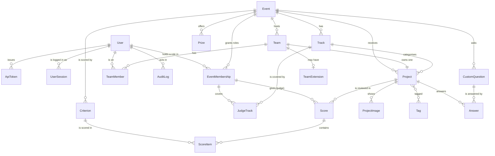

# Data model

The schema, the rules the database itself enforces, and the ways data gets in and out.

Postgres 16 in every real deployment (`docker compose up`). SQLite works for local development
without Docker, minus the two Postgres-only guarantees marked **(pg)** below; the service layer
enforces the same rules there.

## Entity relationships

## The central decision: roles are per event

There is no global "is a judge" column. `EventMembership(user, event, role)` says this person is a
**participant**, **judge** or **organizer** *of this event*. The same person can judge one hackathon
and compete in the next, and an organizer's powers stop at the edge of their own events. The only
platform-wide facts are two flags on `User`: `is_platform_admin` and `can_create_events`.

The **conflict-of-interest rule**, nobody is both a competitor and staff in one event, lives in the
database:

- `EventMembership.side` is a **stored generated column** (`competitor` for participant, `staff` for
  judge and organizer), computed by Postgres, not by Python.
- The exclusion constraint `membership_no_competitor_and_staff` **(pg)** says no two rows for the same
  `(user, event)` may disagree about `side`. A CHECK cannot express that (it depends on other rows),
  and a unique index cannot either (judge + organizer together is allowed). It needs the `btree_gist`
  extension, which ships with Postgres; `events/migrations/0002_membership_conflict_of_interest.py`
  creates both.

A participant membership exists exactly while the person is on a team in that event: the team
services create it on create/join and remove it on leave, removal or disband. That is the design's
"implicit registration" (joining a team registers you).

This is the one place the merged portal departs from the portal-v2 design document, which chose one
role per account. The portals, URLs and refusals are unchanged; see [ARCHITECTURE.md](ARCHITECTURE.md).

## Tables

### accounts

| Table | Holds | Enforced by the database |
|---|---|---|
| `accounts_user` | email (login), name, `is_platform_admin`, `can_create_events`, Argon2id hash | `user_email_ci_unique` on `lower(email)` |
| `accounts_apitoken` | Bearer tokens: name, 8-char prefix, **SHA-256 digest only**, last used, revoked | `digest` unique |
| `accounts_usersession` | one row per logged-in browser: session key, IP, user agent, last seen | `session_key` unique |

### events

| Table | Holds | Enforced by the database |
|---|---|---|
| `events_event` | slug, name, tagline, Markdown description, `starts_at`, `submissions_open_at`, `submissions_close_at`, `original_submissions_close_at`, `judging_ends_at`, min/max team size, `is_published` | `event_submissions_window_valid` (open < close), `event_judging_after_submissions`, `event_starts_before_close`, `event_team_size_range` (1 ≤ min ≤ max ≤ 20) |
| `events_eventmembership` | user, event, role, generated `side`, who added it | `membership_unique_user_event_role`, `membership_role_valid`, `membership_no_competitor_and_staff` **(pg)** |
| `events_judgetrack` | which tracks a judge membership covers (none = every track) | `judge_track_unique` |
| `events_track` | name, description, order, `is_hidden` | `track_name_unique_per_event` |
| `events_prize` | title, value text, rank, optional track | |
| `events_customquestion` | prompt, help, kind (short / long / url / choice / checkbox), choices, required, `is_hidden` | |

The event's **phase** (upcoming, open, judging, finished) is never stored. It is computed from the
dates, so it cannot disagree with them. Tracks and questions already in use are hidden, not deleted,
so old submissions keep their data.

### teams

| Table | Holds | Enforced by the database |
|---|---|---|
| `teams_team` | event, name, captain, reusable `invite_token` | `team_name_unique_per_event` on `lower(name)`; token unique |
| `teams_teammember` | team, user, event (denormalised) | `one_team_per_event` on `(event, user)` |
| `teams_teamextension` | one team's later close, reason, who granted it | one per team |

`TeamMember.event` is a deliberate denormalisation: it is what lets "one team per person per
event" be a plain unique constraint instead of a trigger.

### projects

| Table | Holds | Enforced by the database |
|---|---|---|
| `projects_project` | team (one project per team), event, name, tagline, Markdown description, thumbnail, demo video / repo / live URLs, track, status, `submitted_at`, `last_edited_by` | `project_status_matches_submitted_at`; index on `(event, status)` |
| `projects_projectimage` | up to 8 gallery images (re-encoded by Pillow, metadata stripped), caption, order | |
| `projects_tag`, `projects_project_tags` | free-form tags, up to 50 per project | tag name unique |
| `projects_answer` | a project's answer to one custom question | `one_answer_per_question` |

### scoring: filled by the import, read only by the scoring engine

| Table | Holds | Enforced by the database |
|---|---|---|
| `scoring_criterion` | one rubric line per event: key, label, **decimal `weight`**, min, max, order | `criterion_unique_key_per_event`, `criterion_min_below_max` |
| `scoring_score` | one judge's review of one project: judge **membership**, project, comment | `score_unique_judge_project` |
| `scoring_scoreitem` | the value for one criterion within one review | `scoreitem_unique_per_criterion` |
| `scoring_eventscoringconfig` | one event's engine configuration overrides (JSON); written only by `set_engine_config`, which refuses once judging has closed | one per event |
| `scoring_resultsnapshot` | one computed ranking, kept exactly as computed: kind (`preview` / `final`), method and version, the resolved engine config (seed and λ used), the rubric, the sha256 of the engine input, the result and comparison JSON, who computed it (user **PROTECT** + email) | `snapshot_kind_valid`; **(pg)** trigger `dogfood_snapshot_immutable` refuses every UPDATE |
| `scoring_publication` | which final snapshot is published (model only; no service yet): snapshot (**RESTRICT**), published/unpublished at and by (user **PROTECT** + email) | `publication_one_active_per_event` (partial unique), `publication_unpublished_fields_together`; **(pg)** trigger `dogfood_publication_guard`: only a final snapshot of the same event, and append-only (only unpublishing, once) |

**Actor emails in results cannot be erased.** A snapshot or publication row stores the email of
the account that computed or published it, and the row is immutable (or append-only) at the
database level. The user foreign keys are PROTECT, not SET_NULL, because SET_NULL is an UPDATE the
triggers refuse. So an account named in a result cannot be deleted, and its email cannot later be
removed from those rows. This is a deliberate audit trade-off: a result that could be rewritten,
or lose the record of who produced it, would prove nothing. The full T2 write-up comes in S4.

A score points at the judge's `EventMembership`, not the `User`. "This judge, in this event" is then
one column that cannot disagree with itself, and revoking someone's judge role takes their reviews
with it. Criteria are rows, not columns, so an organizer's own rubric needs no migration. Nothing
assumes a balanced matrix: the fixture has 2–5 reviews per project and 1–11 per judge. See
[JUDGING.md](JUDGING.md).

### core and imports

| Table | Holds |
|---|---|
| `core_auditlog` | every security-relevant action: who, what, subject, IP, user agent, JSON detail. Read-only in the admin, even for admins |
| `imports_fixtureref` | `(source, kind, external_id) → object_id` for every imported row, plus `duplicate_of` and a note |

## Deadline enforcement in the database **(pg)**

`projects/migrations/0002_deadline_trigger.py` installs one PL/pgSQL function as a `BEFORE INSERT
OR UPDATE OR DELETE` trigger on every table a participant can write: `projects_project`,
`projects_answer`, `projects_projectimage`, `projects_project_tags`, `teams_team` and
`teams_teammember`. It looks up the row's event and team, takes the close (or the team's extension
if later), and refuses the write once `statement_timestamp()` has reached it. Organizer tools and the
importer set `dogfood.deadline_bypass` for one transaction through an audited context manager. The
service layer checks the same rule first, so a late write is refused as a clean HTTP 409 and the
trigger is only the backstop.

## Import

### The organizers' fixture file

`docker compose up` runs `manage.py import_fixtures` on every boot (`SEED_FIXTURES=1`). The importer
(`src/imports/fixtures.py`) is **create-only and idempotent** (every created row gets a
`FixtureRef`, and a second run finds the refs and creates nothing) and **all-or-nothing** (one
transaction). It prints a report on every boot.

| Fixture key | Count | Becomes |
|---|---|---|
| `event` | 1 | `events_event` (published; closed 2026-03-01 18:00 UTC) |
| `tracks` | 8 | `events_track` |
| `judges` | 30 | `accounts_user` + `events_eventmembership(judge)` + `events_judgetrack` from each judge's `tracks` |
| `teams` | 40 | `teams_team` + `teams_teammember` + `events_eventmembership(participant)`; members are bare emails → 91 participant accounts |
| `projects` | 41 | 40 `projects_project` (submitted) + 1 duplicate recorded in `imports_fixtureref` |
| `scores` | 126 | 3 `scoring_criterion` + 123 `scoring_score` + 369 `scoring_scoreitem` (3 reviews reported, see below) |

Edge cases, each reported rather than smoothed over:

- **Duplicate submission.** `prj_41` is a second submission by the team behind `prj_07`. The first
  is kept, and `prj_41` is recorded as a `FixtureRef` pointing at the same project with
  `duplicate_of = "prj_07"`. The gallery shows 40 projects.
- **Reviews of the duplicate.** Four judges reviewed `prj_41`. Three of them also reviewed `prj_07`,
  so after folding the two submissions together they would have two reviews of one project, which
  `score_unique_judge_project` forbids. The review of the kept submission wins, and the other three
  are listed in the report. That is why 126 reviews import as 123.
- **The judge who scored everything the same, and the unfinished batches.** These are imported
  exactly as given. Normalising them is T2's job, and the data is left intact for it.
- **Staff who are also on a team, and people on two teams.** Neither occurs in the published file,
  but the importer checks: staff are kept as staff and left off the team (conflict of interest), and
  a second team is skipped. Both cases are reported.
- **Missing dates.** The file gives only `submissions_close`. Submissions open 72 hours earlier (or
  just before the first submission, if earlier), and judging ends 14 days after the close. The
  report lists both as derived.

In demo mode the demo organizer is made an organizer of the fixture event, and both demo judges are
made judges of it, so the `judge_a` and `judge_b` headers in `.dogfood.toml` name real judges.

### Your own data

Accounts are created at `/signup` (always a plain account; joining a team makes it a participant),
by an admin in the admin portal, or by `manage.py create_account` (the bootstrap for the first
admin when `DEMO_MODE=0`). Events, tracks, prizes, questions, judges and co-organizers are set up
from each event's control page in the organizer portal.

## Export

- **JSON:** `GET /api/projects` (the gallery, same query and filters as the page), `GET /api/events`,
  `GET /api/events/<slug>` and `GET /api/projects/<id>`. These are public for published data.
  Bearer tokens work for scripts.
- **Everything:** it is a plain Postgres database, so
  `docker compose exec db pg_dump -U dogfood dogfood > dogfood.sql` takes all of it, and
  `manage.py dumpdata` gives a portable JSON dump.
- **Not built yet:** CSV export of scores (a T2 requirement).
