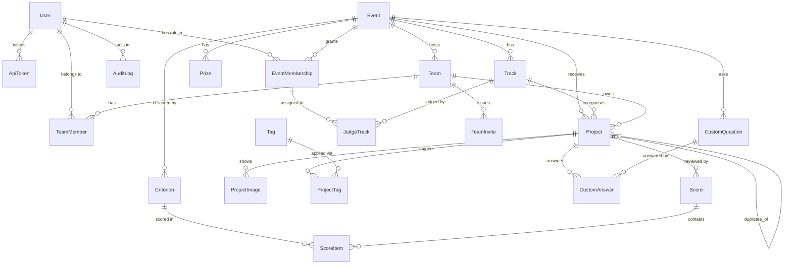

# Data model

> **T1 snapshot.** Accurate for the schema as it stands with T1 complete. The `scoring` tables exist
> and are populated by the fixture import, but nothing reads them yet — see [JUDGING.md](JUDGING.md).
> This document will be expanded after T2.

29 tables, of which 10 are Django's own (`auth_*`, `django_*`, the two M2M join tables on the custom
user). The 19 that matter are below.

## Entity relationships



## Tables

### accounts

| Table | Purpose | Key constraints |
|---|---|---|
| `accounts_user` | Custom user; **email is the login**, no username column | `email` unique, `external_id` unique |
| `accounts_apitoken` | Bearer tokens, **SHA-256 digests only** | `token_hash` unique |

### events

| Table | Purpose | Key constraints |
|---|---|---|
| `events_event` | Name, slug, the four dates, `gallery_public`, `max_team_size` | `slug` unique; `starts_before_submissions_open`; `submissions_open_before_close`; `judging_ends_after_submissions_close`; `max_team_size_at_least_one` |
| `events_track` | Named category within an event | `track_unique_name_per_event` |
| `events_prize` | Prize, optionally tied to a track | `order >= 0` |
| `events_customquestion` | Organizer-defined submission question; `kind`, `required`, `show_in_gallery` | `order >= 0`; a `choice` question needs ≥ 2 distinct options (model-level) |
| `events_eventmembership` | **Role per event**: participant, judge, organizer | `membership_unique_user_event_role`; **`membership_no_competitor_and_staff`** |
| `events_judgetrack` | Which tracks a judge covers | `judgetrack_unique_pair` |

`membership_no_competitor_and_staff` is the conflict-of-interest rule, and it is a Postgres
`ExclusionConstraint` rather than application logic:

```sql
EXCLUDE USING gist (user_id WITH =, event_id WITH =, side WITH <>)
```

`side` is a stored `GeneratedField` — `'competitor'` for a participant, `'staff'` for a judge or
organizer — so the database itself refuses to let one person hold both kinds of role in one event.
Requires the `btree_gist` extension, created in `events/migrations/0001_initial.py`.

### teams

| Table | Purpose | Key constraints |
|---|---|---|
| `teams_team` | Name (**not unique** — see below), event, creator | — |
| `teams_teammember` | Membership plus a captain flag; `event` denormalized onto the row | `teammember_one_team_per_user_per_event`; **`teammember_single_captain_per_team`** (partial unique, `WHERE is_captain`) |
| `teams_teaminvite` | Hashed token, expiry, optional use limit | `token_hash` unique; `max_uses_positive`; `use_count >= 0` |

Team names are deliberately **not** unique: the fixture contains three teams called `StillTrail`, on
purpose, and merging them would corrupt the organizers' data. Imports match on `external_id`, never
on a name.

### projects

| Table | Purpose | Key constraints |
|---|---|---|
| `projects_project` | The submission: name, tagline, markdown description, track, three URLs, thumbnail, `status`, `submitted_at`, `duplicate_of`, `hidden_by_organizer`, `search_vector` | **`project_one_active_per_team_per_event`** (partial unique, `WHERE duplicate_of IS NULL`); **`project_submitted_at_matches_status`** |
| `projects_projectimage` | Gallery image, ≤ 8 per project, with alt text and the verified content type | `order >= 0`; the count limit is enforced by a **row lock** in the service layer, not a constraint |
| `projects_tag` | Normalized technology tag, shared across projects | `name` unique |
| `projects_projecttag` | Explicit through model, so the join row can carry `created_at` | `projecttag_unique_pair` |
| `projects_customanswer` | One answer per question per project; one text column for every question kind | `customanswer_unique_per_question` |

`project_submitted_at_matches_status` keeps the two columns from ever disagreeing:

```sql
CHECK ((status = 'submitted' AND submitted_at IS NOT NULL)
    OR (status = 'draft'     AND submitted_at IS NULL))
```

So "is it submitted?" is answerable from either column. The service sets both in one write or neither.

Indexes beyond the primary and foreign keys: `(event, status)`, `(event, track)`, a GIN index on
`search_vector`, and a **pg_trgm GIN index on `Upper(name)`** for the gallery's partial-word matching
(`projects/migrations/0003`). The `Upper` matters — it is exactly what Django renders `icontains` as
on Postgres, and an index on the bare column would not be used.

### core

| Table | Purpose | Key constraints |
|---|---|---|
| `core_auditlog` | Actor, event, action code, `(target_type, target_id)` as **loose strings**, JSON metadata | actor and event nullable |

The target is stored as a type name plus a stringified primary key rather than a foreign key, so a row
outlives what it describes: a foreign key would either cascade the evidence away or block the
deletion. `tests/test_audit_trail.py` asserts a `team.deleted` entry survives its team.

### scoring — present, unused

| Table | Purpose | Key constraints |
|---|---|---|
| `scoring_criterion` | A rubric line: key, label, min, max, **weight** | `criterion_unique_key_per_event`; `criterion_min_below_max` |
| `scoring_score` | One judge's review of one project, with a comment | `score_unique_judge_project` |
| `scoring_scoreitem` | The per-criterion value inside a review | `scoreitem_unique_per_criterion` |

These are populated by the fixture import (126 reviews, 378 items) and read by nothing. `score_unique_judge_project`
is the constraint T2 will rely on to keep a judge from double-reviewing.

## Fixture mapping

`acceptance/fixtures.json` → the schema. Every importable model carries a nullable, unique
`external_id`, and imports upsert by it — which is what makes a boot idempotent.

| Fixture key | Count | Target | `external_id` |
|---|---|---|---|
| `event` | 1 | `events_event` | `evt_01` |
| `tracks` | 8 | `events_track` | `trk_01` … `trk_08` |
| `judges` | 30 | `accounts_user` + `events_eventmembership` (+ `events_judgetrack` from `tracks`) | `jdg_01` … `jdg_30` |
| `teams` | 40 | `teams_team` + `teams_teammember`; members are bare email addresses → `accounts_user` | `tm_01` … `tm_40` |
| `projects` | 41 | `projects_project` | `prj_01` … `prj_41` |
| `scores` | 126 | `scoring_score` + `scoring_scoreitem` (378 items, one per key in `criteria`) | none — see below |

### Field-level notes

- `projects[].title` → `Project.name`, `projects[].summary` → `Project.tagline`. The JSON write
  endpoint accepts both spellings for this reason; the fixture's vocabulary is the organizers'
  interchange format.
- `event.submissions_close` is the **only** date the fixture supplies. `starts_at`,
  `submissions_open_at` and `judging_ends_at` are **synthesized** (a 72-hour submission window, a
  10-day judging window) and the import report lists them as synthesized rather than presenting them
  as fixture data.
- **Scores are the one importable record with no fixture id.** The file gives each score a judge
  and a project but no `id`, so the import matches on `(judge, project)` — which is exactly the
  model's unique key, so it is idempotent anyway and `external_id` stays null.
- `scores[].criteria` is an object with three keys — `functionality`, `quality`, `innovation` — which
  become three `scoring_criterion` rows for the event, each `weight 1.000`, `min 1`, `max 5`. Equal
  weights because the fixture supplies none; configuring them is T2's job.
- **Absent, and left empty** rather than invented: project descriptions, thumbnails, gallery images,
  tags, demo and live URLs, track descriptions, prizes, custom questions. The import report names
  these explicitly.
- Participant display names are the email local part — the fixture lists team members as bare email
  addresses and supplies no names.
- **41 projects, 40 visible.** One is a genuine duplicate by the importer's rule (same team **and**
  either the same normalized title or the same repo URL); the earlier submission is canonical and the
  later one gets `duplicate_of` set, which removes it from the gallery. That is why the gallery shows
  40 and why the whole cohort fits on one 50-row page.
- Review coverage is uneven by design: projects carry 2–5 reviews and judges 1–11. Nothing in the
  schema assumes a balanced matrix.
