# Data model

The schema, the rules the database itself enforces, and the ways data gets in and out.

Postgres 16 in every real deployment (`docker compose up`). SQLite works for local development
without Docker, minus the Postgres-only guarantees marked **(pg)** below (triggers and an exclusion
constraint); the service layer enforces the same rules there.

## Entity relationships

```mermaid
erDiagram
    User ||--o{ ApiToken : "issues"
    User ||--o{ UserSession : "is logged in as"
    User ||--o{ EventMembership : "holds a role in"
    User ||--o{ TeamMember : "is on"
    User ||--o{ AuditLog : "acts in"

    Event ||--o{ EventMembership : "grants roles"
    Event ||--o{ Track : "has"
    Event ||--o{ Prize : "offers"
    Event ||--o{ CustomQuestion : "asks"
    Event ||--o{ Team : "hosts"
    Event ||--o{ Project : "receives"
    Event ||--o{ Criterion : "is scored by"

    EventMembership ||--o{ JudgeTrack : "covers"
    Track ||--o{ JudgeTrack : "is covered by"
    EventMembership ||--o{ Score : "gives (judge)"
    EventMembership ||--o{ Assignment : "is asked (judge)"
    Project ||--o{ Assignment : "is assigned in"
    AssignmentRound ||--o{ Assignment : "created"
    Event ||--o{ AssignmentRound : "runs"
    Event ||--o{ JudgeInvite : "invites"

    Team ||--o{ TeamMember : "has"
    Team ||--o| TeamExtension : "may have"
    Team ||--|| Project : "owns one"

    Track ||--o{ Project : "categorises"
    Project ||--o{ ProjectImage : "shows"
    Project }o--o{ Tag : "tagged"
    Project ||--o{ Answer : "answers"
    CustomQuestion ||--o{ Answer : "is answered by"
    Project ||--o{ Score : "is reviewed in"

    Criterion ||--o{ ScoreItem : "is scored in"
    Score ||--o{ ScoreItem : "contains"

    Event ||--o{ ResultSnapshot : "is ranked in"
    Event ||--o| EventResultSettings : "shows results as"
    ResultSnapshot ||--o{ Publication : "is published by"
    Event ||--o| VotingConfig : "may hold a vote"
    Event ||--o{ VoterLink : "allowlists"
    Event ||--o{ Ballot : "collects"
    User ||--o{ Ballot : "casts (logged in)"
    VoterLink ||--o| Ballot : "casts (by link)"
    Ballot ||--o{ BallotLine : "places credits"
    Project ||--o{ BallotLine : "receives credits"
    Event ||--o{ VoteTallySnapshot : "freezes"
    VoteTallySnapshot ||--o{ ResultSnapshot : "is used by (final)"
```

## The central decision: roles are per event

There is no global "is a judge" column. `EventMembership(user, event, role)` says this person is a
**participant**, **judge** or **organizer** *of this event*. The same person can judge one hackathon
and compete in the next, and an organizer's powers stop at the edge of their own events. The only
platform-wide facts are two flags on `User`: `is_platform_admin` and `can_create_events`.

The **conflict-of-interest rule**, nobody is both a competitor and staff in one event, lives in the
database:

- `EventMembership.side` is a **stored generated column** (`competitor` for participant, `staff` for
  judge and organizer), computed by Postgres, not by Python.
- The exclusion constraint `membership_no_competitor_and_staff` **(pg)** says no two rows for the same
  `(user, event)` may disagree about `side`. A CHECK cannot express that (it depends on other rows),
  and a unique index cannot either (judge + organizer together is allowed). It needs the `btree_gist`
  extension, which ships with Postgres; `events/migrations/0002_membership_conflict_of_interest.py`
  creates both.

A participant membership exists exactly while the person is on a team in that event: the team
services create it on create/join and remove it on leave, removal or disband. That is the design's
"implicit registration" (joining a team registers you).

This is the one place the merged portal departs from the portal-v2 design document, which chose one
role per account. The portals, URLs and refusals are unchanged; see [ARCHITECTURE.md](ARCHITECTURE.md).

## Tables

### accounts

| Table | Holds | Enforced by the database |
|---|---|---|
| `accounts_user` | email (login), name, `is_platform_admin`, `can_create_events`, Argon2id hash | `user_email_ci_unique` on `lower(email)` |
| `accounts_apitoken` | Bearer tokens: name, 8-char prefix, **SHA-256 digest only**, last used, revoked | `digest` unique |
| `accounts_usersession` | one row per logged-in browser: session key, **IP hash** (never the address), user agent, last seen | `session_key` unique |

### events

| Table | Holds | Enforced by the database |
|---|---|---|
| `events_event` | slug, name, tagline, Markdown description, `starts_at`, `submissions_open_at`, `submissions_close_at`, `original_submissions_close_at`, `judging_starts_at`, `judging_ends_at`, `original_judging_ends_at`, `results_at` (null = to be announced), min/max team size, `is_published` | a strictly ordered timeline, one CHECK per step: `event_starts_before_submissions_open`, `event_submissions_window_valid` (open < close), `event_judging_starts_after_close`, `event_judging_window_valid`, `event_results_after_judging` (when set); `event_team_size_range` (1 ≤ min ≤ max ≤ 20) |
| `events_eventmembership` | user, event, role, generated `side`, who added it | `membership_unique_user_event_role`, `membership_role_valid`, `membership_no_competitor_and_staff` **(pg)** |
| `events_judgetrack` | which tracks a judge membership covers (none = every track) | `judge_track_unique` |
| `events_judgeinvite` | a one-time judge or co-organizer link (`role`): email (empty = open link), tracks (judges), SHA-256 **digest** of the token (never the token), expiry, accepted/revoked timestamps | `judge_invite_one_pending_per_email` (partial unique), `judge_invite_not_accepted_and_revoked` |
| `events_track` | name, description, order, `is_hidden` | `track_name_unique_per_event` |
| `events_prize` | title, value text, rank, optional track | |
| `events_customquestion` | prompt, help, kind (short / long / url / choice / checkbox), choices, required, `is_hidden` | |

The timeline is **strictly** ordered: event starts < submissions open < submissions close < judging
starts < judging ends < results. Equal dates are refused too. Migration
`events/0004_judging_start_results_strict_timeline` brought existing events into line: judging
starts one hour after the close (or halfway to the judging end, if judging was shorter than two
hours), and an event start that coincided with submissions opening moved one hour earlier.

The event's **phase** (upcoming, open, closed, judging, finished) is never stored. It is computed from the
dates, so it cannot disagree with them. Tracks and questions already in use are hidden, not deleted,
so old submissions keep their data.

### teams

| Table | Holds | Enforced by the database |
|---|---|---|
| `teams_team` | event, name, captain, reusable `invite_token` | `team_name_unique_per_event` on `lower(name)`; token unique |
| `teams_teammember` | team, user, event (denormalised) | `one_team_per_event` on `(event, user)` |
| `teams_teamextension` | one team's later close, reason, who granted it | one per team |

`TeamMember.event` is a deliberate denormalisation: it is what lets "one team per person per
event" be a plain unique constraint instead of a trigger.

### projects

| Table | Holds | Enforced by the database |
|---|---|---|
| `projects_project` | team (one project per team), event, name, tagline, Markdown description, thumbnail, demo video / repo / live URLs, track, status, `submitted_at`, `last_edited_by` | `project_status_matches_submitted_at`; index on `(event, status)` |
| `projects_projectimage` | up to 8 gallery images (re-encoded by Pillow, metadata stripped), caption, order | |
| `projects_tag`, `projects_project_tags` | free-form tags, up to 50 per project | tag name unique |
| `projects_answer` | a project's answer to one custom question | `one_answer_per_question` |

### scoring: the rubric, the reviews, who reviews what, and the results

| Table | Holds | Enforced by the database |
|---|---|---|
| `scoring_criterion` | one rubric line per event: key, label, **relative `weight`** (decimal, three places, above 0; a criterion's share is weight / sum), the 1-5 scale, order, description, a written anchor per score level (`level_descriptions`) | `criterion_unique_key_per_event`, `criterion_weight_positive`, `criterion_scale_is_1_to_5` |
| `scoring_score` | one judge's review of one project: judge **membership**, project, comment, `submitted_at` (null = draft) | `score_unique_judge_project` |
| `scoring_assignmentround` | one run of the automatic assignment: kind (initial / top-up / reassign), **random seed**, review target, load cap, summary of warnings | |
| `scoring_assignment` | a judge membership asked to review a project: source (import / auto / manual), status (assigned / declined_conflict / withdrawn), queue position, decline reason | `assignment_one_live_per_judge_project` (partial unique over assigned + declined), status and source CHECKs |
| `scoring_scoreitem` | the value for one criterion within one review | `scoreitem_unique_per_criterion` |
| `scoring_eventscoringconfig` | one event's engine configuration overrides (JSON; written only by `set_engine_config`, refused once judging has closed) and the final score's **`judge_weight` / `community_weight`** (whole numbers; written only by `set_final_weights`) | one per event; `scoring_final_weights_sum_to_100`; **(pg)** trigger `dogfood_weights_lock`: the weights cannot change once judging or voting has opened (bypass: `dogfood.weights_bypass`, audited) |
| `scoring_eventresultsettings` | who sees a published result (`public_full` / `public_winners` / `private`, default private) and how many overall winners it names | one per event; `result_visibility_valid`, `result_winners_top_n_range` |
| `scoring_resultsnapshot` | one computed ranking, kept exactly as computed: kind (`preview` / `final`), method and version, the resolved engine config (seed and λ used), the rubric, the sha256 of the engine input, the result and comparison JSON, who computed it (user **PROTECT** + email); for T3, the frozen vote tally a final used (`vote_tally`, **PROTECT**), the weights used, and the `combined` ranking | `snapshot_kind_valid`; **(pg)** trigger `dogfood_snapshot_immutable` refuses every UPDATE |
| `scoring_publication` | which final snapshot is published (written only by `publish_results` / `unpublish_results`): snapshot (**RESTRICT**), published/unpublished at and by (user **PROTECT** + email) | `publication_one_active_per_event` (partial unique), `publication_unpublished_fields_together`; **(pg)** trigger `dogfood_publication_guard`: only a final snapshot of the same event, and append-only (only unpublishing, once) |

**Actor emails in results cannot be erased.** A snapshot or publication row stores the email of
the account that computed or published it, and the row is immutable (or append-only) at the
database level. The user foreign keys are PROTECT, not SET_NULL, because SET_NULL is an UPDATE the
triggers refuse. So an account named in a result cannot be deleted, and its email cannot later be
removed from those rows. This is a deliberate audit trade-off: a result that could be rewritten,
or lose the record of who produced it, would prove nothing. Deactivate such an account instead.

**What can be deleted, and what is permanent.** Earlier docs said a project was "deletable only
before submission". Nothing ever enforced that. These are the actual rules:
- **The time trigger** (below) refuses any delete of a project, team or team member once the event
  (or the team's extension) has closed. Before the close, the last member leaving deletes the team
  and its draft project (`teams/services.py::leave_team`, which refuses if the project is submitted).
- **The timeline freeze.** Once judging has started *and* the event has an assignment or a score,
  `events/services.py::update_event` refuses to move `submissions_open_at`, `submissions_close_at`
  or `judging_starts_at` (409, audited `event_change_refused`), and the settings form shows them
  locked. So submissions cannot be reopened under the judges, which was the one way a scored project
  could go back to draft and be deleted. An event with no assignments and no scores stays fixable.
  `judging_ends_at` stays editable.
- **The RESTRICT backstop.** `Score.project` and `Score.judge` are RESTRICT, and nothing cascades to
  a Score. A project, a judge's membership or a user with any review (submitted or draft) cannot be
  deleted through the ORM (`RestrictedError`). `leave_team` answers that as a team rule ("the project
  has reviews"). `remove_judge` refuses a judge with a submitted review and deletes drafts
  explicitly.
- **Permanent events.** An event with reviews (Score RESTRICT), ballots (`Ballot.event` PROTECT) or,
  from C2, issued records (`IssuedRecord.event` PROTECT) cannot be deleted through the ORM at all.
  The delete raises and nothing is deleted. No page or command deletes events. An event without any
  of these still cascades to its tracks, teams, projects, snapshots and the rest.

Assignments are never deleted: withdrawing or declining one changes its status, so "who was asked
to review what, and what became of it" stays answerable. A declined assignment still blocks the
same pair, because declining means a conflict of interest. The assignment round keeps its random
seed, so any round can be reproduced exactly.

A score points at the judge's `EventMembership`, not the `User`. "This judge, in this event" is then
one column that cannot disagree with itself, and revoking someone's judge role takes their reviews
with it. Criteria are rows, not columns, so an organizer's own rubric needs no migration. Nothing
assumes a balanced matrix: the fixture has 2–5 reviews per project and 1–11 per judge. See
[JUDGING.md](JUDGING.md).

### voting: the community vote (T3)

| Table | Holds | Enforced by the database |
|---|---|---|
| `voting_votingconfig` | one event's vote: `opens_at` / `closes_at` (and `original_closes_at`), access mode (authenticated / email_gated / open_link), method (one person one vote / quadratic), `credit_budget`, "accounts created before voting opened only", the per-event ballot secret, the open-link nonce, a freeze counter | one per event; window, mode, method and budget CHECKs (`voting_one_person_one_vote_budget_is_1`); **(pg)** trigger `dogfood_voting_config`: once voting has opened, the row cannot be deleted and `opens_at` / event cannot change |
| `voting_voterlink` | email_gated: one allowlisted email per row, a nonce, the **SHA-256 digest** of its link token (the token is derived, not stored), revoked at/by | `voterlink_one_per_email_per_event`, digest unique |
| `voting_ballot` | one voter's ballot: exactly one identity (`voter_user` / `voter_link` / `voter_cookie`), created/updated at, the **IP hash** of the creating and of the last write, and the void fields (at, by, reason) | one per identity per event (three partial uniques), `ballot_has_exactly_one_voter`, `ballot_void_fields_together`; **(pg)** trigger `dogfood_voting_window` |
| `voting_ballotline` | the credits one ballot places on one project, and where the project was shown (`shown_position`) | one per ballot and project, one per ballot and position; **(pg)** trigger `dogfood_voting_window` |
| `voting_votetallysnapshot` | one frozen count (per project: influence, ballots, credits), the voided ballot ids, the input hash, the previous tally and what changed since it | **(pg)** trigger `dogfood_tally_immutable` refuses every UPDATE; `event`, `created_by`, `previous` are PROTECT |

**The voting trigger (pg)** (`voting/migrations/0002`, `0004`): no INSERT or UPDATE of a ballot or
line outside `[opens_at, closes_at)` by `statement_timestamp()`, except an UPDATE of a ballot that
changes only its void columns (voiding and restoring work at any time); and **no DELETE of a ballot
or line once voting has opened**. The foreign keys into ballots are PROTECT (`Ballot.event`,
`Ballot.voter_user`, `Ballot.voter_link`, `Ballot.voided_by`, `BallotLine.project`), so no cascade
from an event, project, team or account can remove a vote; a test pins the full list. The one way past
the trigger is `dogfood.voting_bypass`, set for one block by the audited `voting_bypass`.

### records: signed records (C2)

| Table | Holds | Rules |
|---|---|---|
| `records_signingkey` | this install's Ed25519 keys, **public halves only**: `kid` (the first 16 hex of sha256 of the 32-byte raw key), `alg`, `public_key` (base64), `created_at`, `retired_at` | `signing_key_one_active` (partial unique: at most one key with `retired_at` NULL); **(pg)** trigger `dogfood_signing_key_guard`: no DELETE, and the only change allowed is retiring, once |
| `records_foreignsigningkey` | public keys of other installs that came with an imported bundle, published apart from this install's own and never used to sign | |
| `records_issuedrecord` | one signed statement: `id` (uuid), `kind` (judge_participation / participant / winner), `slot`, event (**PROTECT**), subject user (**PROTECT**), `payload` and `payload_text` (exactly the canonical bytes that were signed), `signature` (base64), `kid`, `is_foreign`, issued by and at, and the revoke fields | `record_one_active_per_slot` (partial unique on event, subject, kind, slot while not revoked); `slot` is "" for judge and participant records and `winner_slot(track, place, peoples_choice)` for winners, so two different wins by one person are two records; `record_revoke_fields_together`; **(pg)** trigger `dogfood_record_guard`: no DELETE, and an UPDATE may only set the revoke fields, once, with a reason |

**The private keys** are PEM files at `<SIGNING_KEY_DIR>/<kid>.pem`: PKCS8, created with O_EXCL and
mode 0600, in a 0700 directory. In compose that directory is `/app/secrets/signing`, inside the
`secrets` named volume, never in the repo or the image. The database decides which key signs: the one
row with `retired_at` NULL. A PEM file with no row is never adopted.

**Issuing** (`records/services.py`, organizers of the event and admins; audited; refusals too):
- Judge records: once judging has closed (`409 judging_open`), for judges with at least one
  submitted review. The payload holds the review count and the judging window, never a score.
- Participant records: once submissions have closed (`409 submissions_open`), for everyone who is a
  member of a team with a submitted project **at the moment the records are issued**. Someone who
  left before the close is not a member, so gets none. Nobody can leave after the close, because the
  service and the deadline trigger refuse it. The exceptions are an organizer's audited deadline
  bypass, or a team extension that ends before judging. A person removed that way has their record
  revoked on the next issue ("no longer eligible").
- Winner records: only from the active published final (`409 no_published_final`), one per win:
  overall places, the top of each track, People's Choice.
- If the active key's file is missing, issuing is refused with `503 signing_unavailable`. The
  organizer Records page and the admin home then say why, and what to do: restore the `secrets`
  volume, or rotate.

**The payload's event block** holds the slug, name, `submissions_open_at` and
`submissions_close_at`. These dates are frozen once judging has work (the timeline freeze), so a
record's meaning never changes because judging was extended.

**Idempotent by meaning.** A record is compared on everything but `record_id`, `issued_at` and
`kid`.
- If nothing else changed, it is kept.
- If something changed, the old one is revoked and a new one is signed. Its category is
  `superseded`, and its page links to the newer record.
- Someone no longer eligible has theirs revoked with the category `no_longer_eligible`.
- The one audit row summarising a reissue lists the revoked record ids.
- Only judge records carry the judging window, so moving the judging end reissues judge records
  only. Participant and winner records stay as they are.

**What the public sees of a revocation** is the category only: superseded (with the link), no
longer eligible, or revoked by the organizer. The organizer's typed reason stays on the organizer's
Records page and in the audit log.

**Public endpoints:**
- `/records/<uuid>`: the certificate, checked on the server, printable without script.
- `/records/<uuid>.json`.
- `/verify`: accepts only canonical bytes, needs a CSRF token, and is limited per IP hash, counted
  from `AuditLog.objects.live()`.
- `/.well-known/dogfood-signing-keys.json`: this install's keys only, retired ones included.
- `/.well-known/dogfood-foreign-signing-keys.json`: other installs' keys. A record they signed is
  labelled "signed by another install (kid X)".
- `/.well-known/dogfood-revoked.json`: never the ids themselves, because a record's id is its
  certificate's address. Each revoked record appears as `record_id_sha256`, the sha256 of the
  record_id in its usual text form (lower-case, with hyphens), UTF-8, as hex. A verifier hashes the
  record_id it holds and looks it up.

`manage.py ensure_signing_key` runs at every boot. It creates the first key, and after that only
checks it. If the active key's file is missing, it reports that loudly without stopping the boot,
and signing is refused until `manage.py rotate_signing_key`. Rotation writes the new file, then, in
one transaction, retires the old row first and inserts the new one. The old key stays published.

### core and imports

| Table | Holds |
|---|---|
| `core_auditlog` | every security-relevant action: who, what, subject, **IP hash** (never the address), user agent, JSON detail. Read-only in the admin, even for admins. Rate limits (logins, vote writes) are counted from it |
| `imports_fixtureref` | `(source, kind, external_id) → object_id` for every imported row, plus `duplicate_of`, a note, and **`event`** (CASCADE; required by a CHECK for every kind but `user`, the one install-wide kind). `source` is `dogfood-fixtures` for the organizers' file or `bundle:<sha256>:<new slug>` for refs an event bundle brought in. Scoring finds an event's project and score refs by `event`, whatever the source. The backfill (`imports/0004`) deleted refs whose row no longer existed. Side effect: running `import_fixtures` again re-creates such a row, because the organizers' file still lists it |

## Deadline enforcement in the database **(pg)**

`projects/migrations/0002_deadline_trigger.py` installs one PL/pgSQL function as a `BEFORE INSERT
OR UPDATE OR DELETE` trigger on every table a participant can write: `projects_project`,
`projects_answer`, `projects_projectimage`, `projects_project_tags`, `teams_team` and
`teams_teammember`. It looks up the row's event and team, takes the close (or the team's extension
if later), and refuses the write once `statement_timestamp()` has reached it. Organizer tools and the
importer set `dogfood.deadline_bypass` for one transaction through an audited context manager. The
service layer checks the same rule first, so a late write is refused as a clean HTTP 409 and the
trigger is only the backstop.

## Import

### The organizers' fixture file

`docker compose up` runs `manage.py import_fixtures` on every boot (`SEED_FIXTURES=1`). The importer
(`src/imports/fixtures.py`) is **create-only and idempotent** (every created row gets a
`FixtureRef`, and a second run finds the refs and creates nothing) and **all-or-nothing** (one
transaction). It prints a report on every boot.

| Fixture key | Count | Becomes |
|---|---|---|
| `event` | 1 | `events_event` (published; closed 2026-03-01 18:00 UTC) |
| `tracks` | 8 | `events_track` |
| `judges` | 30 | `accounts_user` + `events_eventmembership(judge)` + `events_judgetrack` from each judge's `tracks` |
| `teams` | 40 | `teams_team` + `teams_teammember` + `events_eventmembership(participant)`; members are bare emails → 91 participant accounts |
| `projects` | 41 | 40 `projects_project` (submitted) + 1 duplicate recorded in `imports_fixtureref` |
| `scores` | 126 | 3 `scoring_criterion` + 123 `scoring_score` (submitted) + 369 `scoring_scoreitem` + 123 `scoring_assignment` (source `import`); 3 reviews reported, see below |

Edge cases, each reported rather than smoothed over:

- **Duplicate submission.** `prj_41` is a second submission by the team behind `prj_07`. The first
  is kept, and `prj_41` is recorded as a `FixtureRef` pointing at the same project with
  `duplicate_of = "prj_07"`. The gallery shows 40 projects.
- **Reviews of the duplicate.** Four judges reviewed `prj_41`. Three of them also reviewed `prj_07`,
  so after folding the two submissions together they would have two reviews of one project, which
  `score_unique_judge_project` forbids. The review of the kept submission wins, and the other three
  are listed in the report. That is why 126 reviews import as 123.
- **The judge who scored everything the same, and the unfinished batches.** These are imported
  exactly as given. Normalising them is T2's job, and the data is left intact for it.
- **Staff who are also on a team, and people on two teams.** Neither occurs in the published file,
  but the importer checks: staff are kept as staff and left off the team (conflict of interest), and
  a second team is skipped. Both cases are reported.
- **Missing dates.** The file gives only `submissions_close`. Submissions open 72 hours earlier (or
  just before the first submission, if earlier), the event starts an hour before that, judging
  starts an hour after the close and ends 14 days after it, and results stay to be announced. The
  report lists each derived date.

In demo mode the demo organizer is made an organizer of the fixture event, and both demo judges are
made judges of it, so the `judge_a` and `judge_b` headers in `.dogfood.toml` name real judges.

### Your own data

Accounts are created at `/signup` (always a plain account; joining a team makes it a participant),
by an admin in the admin portal, or by `manage.py create_account` (the bootstrap for the first
admin when `DEMO_MODE=0`). Events, tracks, prizes, questions, judges and co-organizers are set up
from each event's control page in the organizer portal.

## Export

- **JSON:** `GET /api/projects` (the gallery, same query and filters as the page), `GET /api/events`,
  `GET /api/events/<slug>` and `GET /api/projects/<id>`. These are public for published data.
  Bearer tokens work for scripts.
- **Everything:** it is a plain Postgres database, so
  `docker compose exec db pg_dump -U dogfood dogfood > dogfood.sql` takes all of it, and
  `manage.py dumpdata` gives a portable JSON dump.
- **CSV, stage by stage:** each sheet unlocks when its stage starts. Organizers download
  `GET /api/export.zip?event=<slug>` (one CSV per open sheet: event, tracks, prizes, questions, rubric, judges, invites, teams, members,
  projects, assignments, assignment rounds, submitted reviews, results, audit, plus a README), or
  one sheet with `GET /api/export.csv?event=<slug>&sheet=<name>`; the same links are on each
  event's page. Secrets (team invite tokens, judge invite digests) and draft reviews are never
  exported. See [JUDGING.md](JUDGING.md#csv-export) for the rules.
- **Results** (organizers of the event): `winners.csv` (winners and People's Choice, with each team
  member's name and email) and `results.csv` (every project of the latest final: final rank, judged
  percentile, M2 rank, tie group, influence, vote percentile, People's Choice position).
- **Voting** (organizers of the event): `tally.csv` (the live tally),
  `GET /api/events/<slug>/votes/tally`, and `voter-links.csv` (email_gated: each email's link).
- Every CSV goes through one writer (`core/csvfile.py`): UTF-8 with a BOM, and text cells starting
  with `=`, `+`, `-`, `@`, a tab or a carriage return are prefixed with `'` so a spreadsheet shows them
  instead of running them. Every download is audited.

## Event bundle (export; the import follows in C1b/C1c)

One zip that carries a whole event to another install: `imports/bundle.py`. Organizers of the event
and platform admins download it from the event page ("download event bundle",
`GET /organizer/events/<slug>/bundle`), from `GET /api/events/<slug>/bundle`, or on the host with
`manage.py export_event <slug> <file>`. Every download is audited (`event_exported`, with the zip's
sha256); every refusal too (`event_export_refused`).

### Files

| path | what |
|---|---|
| `manifest.json` | `format` = `"dogfood-event-bundle"`, `version` = 1, `generator`, `created_at` (database clock, ISO 8601), `source_event` (the slug), and `files`: `{path: sha256}` for **every other file and only those** |
| `event.json` | the event and everything in it (below) |
| `media/<sha256>.<ext>` | thumbnails and gallery images, named by the sha256 of their bytes; `ext` is `jpg`, `png` or `webp` |

Every file is UTF-8 JSON written with sorted keys and no whitespace (`ensure_ascii` off, so every
string round-trips exactly). Zip entries are sorted, with a fixed timestamp (1980-01-01). The zip is
refused before it is written if the import could not take it back:
- more than `BUNDLE_MAX_ENTRIES` (2000) files;
- `event.json` over `BUNDLE_MAX_EVENT_JSON_BYTES` (50 MB);
- an image over `BUNDLE_MAX_MEDIA_BYTES` (5 MB);
- over `BUNDLE_MAX_TOTAL_BYTES` (300 MB) uncompressed;
- a zip over `BUNDLE_MAX_BYTES` (100 MB).

The zip is written to a temporary file, never held in memory.

### event.json

**Layout.** Top-level keys are `format`, `version`, then one key per section. Rows are lists in
primary-key order. One-per-event sections (`event`, `scoring_config`, `result_settings`,
`voting_config`) are a single object or `null`.

**Bundle ids.** Each row of a list carries `id`, a **bundle id** `"<section>#<n>"`, numbered 1..n in
that order. No source primary key is used as a bundle id, as a reference between rows, or in any
declared id location inside JSON (below). Source ids do still appear in two places, by design or
because they cannot be known: audit rows' `detail` (kept as source history, see below), and free
text people wrote (a description or a comment that mentions "#12" is not examined). Every
reference to another row is that row's bundle id. References to the event itself are left out, because every row belongs to it. References to
accounts are `"users#<n>"`.

**Values.**
- Datetimes are ISO 8601 with their offset.
- Decimals are strings (`"4.50"`).
- Files are `media/...` paths (or `""`).
- Tags are a sorted list of names.

| section | model | notes |
|---|---|---|
| `event` | events.Event | every column but the primary key |
| `tracks`, `prizes`, `questions` | Track, Prize, CustomQuestion | |
| `memberships` | EventMembership | `user`, `role`, `added_by`, `added_at` (`side` is generated, left out) |
| `judge_tracks` | JudgeTrack | `membership`, `track` |
| `teams` | Team | **no `invite_token`** (the import makes new ones) |
| `team_members`, `team_extensions` | TeamMember, TeamExtension | |
| `projects` | Project | `thumbnail` is a media path, `tags` a list of names |
| `project_images`, `answers` | ProjectImage, Answer | |
| `comments` | Comment | hidden and deleted comments too, with who hid them and why |
| `criteria` | Criterion | `level_descriptions` keys are rubric levels ("1".."5"), not ids |
| `assignment_rounds`, `assignments` | AssignmentRound, Assignment | `summary` ids remapped (below) |
| `scores`, `score_items` | Score, ScoreItem | drafts too |
| `scoring_config`, `result_settings` | EventScoringConfig, EventResultSettings | |
| `voting_config` | VotingConfig | **no `ballot_secret`, no `open_link_nonce`** (the import makes new ones) |
| `ballots` | Ballot | **`voter` is a pseudonym**; no voter account, link or cookie, **no IP hashes** |
| `ballot_lines` | BallotLine | |
| `tally_snapshots` | VoteTallySnapshot | JSON ids remapped; `input_hash` is the source install's |
| `result_snapshots` | ResultSnapshot | JSON ids remapped; `input_hash` is the source install's |
| `publications` | Publication | |
| `fixture_refs` | imports.FixtureRef | only `project` and `score` refs of this event's rows, selected by (kind, object_id); `object` is the row's bundle id |
| `audit` | core.AuditLog | rows with `subject` = the slug or `detail.event` = the slug; see below |
| `users` | accounts.User | `{id, email, name}` of every account the rows above reference, **except accounts that appear only as voters** |

**Never in a bundle:**
- password hashes;
- sessions;
- API tokens;
- judge and organizer invites (and their digests);
- team invite tokens;
- voter links (their nonces and digests);
- the vote's ballot secret and open-link nonce;
- any IP hash;
- audit user agents;
- SECRET_KEY and every key derived from it.

`tests/test_bundle_export.py` greps the bundle's bytes for each of them.

**Voter pseudonyms.** Each ballot's voter is `"v_" + HMAC-SHA256(salt, identity)[:16]`.
- The salt is 32 random bytes made for this one export and then discarded.
- The identity is the voter's account, link or open-link cookie.
- The same pseudonym replaces that voter in the voting audit rows: the actor and `actor_email` of
  ballot-opened and vote-cast/changed/refused/throttled rows, and `detail.voter` / `detail.email`
  where an organizer voided, restored or revoked.

Ballots can be grouped by voter within one bundle, but never tied to an account. Two exports give
different pseudonyms.

**Audit rows** are source history: `{id, created_at, action, actor, actor_email, subject, detail}`.
- `detail` keeps the source install's ids as they were (a ballot number, a project number). They are
  labelled source history, not remapped.
- Keys naming secrets or addresses are dropped at any depth. A key is split into its
  `_`-separated segments (lower-cased) and dropped if any segment is one of `token`, `tokens`,
  `prefix`, `digest`, `secret`, `nonce`, `password`, `ip`, or if it contains the pair `user`,
  `agent`. Whole segments only, never substrings: `ip_hash`, `created_ip_hash`, `token_prefix`,
  `token_digest`, `ballot_secret`, `open_link_nonce` and `user_agent` are dropped, while
  `description`, `recipient`, `skip` and `tokenizer` are kept (`tests/test_bundle_export.py`).

### Ids inside JSON columns

Results, tallies and assignment summaries store database ids as data. `imports/bundle_ids.py`
declares every location, with one kind each, and rewrites them to bundle ids. The import rewrites
them to the new primary keys.

| kind | meaning |
|---|---|
| `plain` | one id of a namespace (projects, memberships, tracks, ballots, tally_snapshots, result_snapshots): `"25"` becomes `"projects#3"`, `4` becomes `"ballots#2"` |
| `composite` | a review id `"<judge>:<project>"`: both halves remapped (`"memberships#16:projects#33"`) |
| `external` | kept byte for byte: a fixture id (`"dup:prj_41"`, the engine's name for a folded duplicate), a criterion key, a rubric level, the judges' weight |

Rules for particular values:
- A project reference is `plain` unless it is a `dup:` id, which is external.
- An exclusion's `id` follows its `kind`: review → composite, project → plain (external for
  `dup:`), judge → plain.
- Prose that names ids: the engine's stored reason templates that interpolate an id are listed in
  `bundle_ids.TEXT_TEMPLATES`, and an exclusion `reason` that fully matches one has each id field
  remapped:
  - `review of duplicate submission {dup} (kept: {project})`
  - `judge also reviewed {project}, the kept submission; that review is used`
  - `duplicate submission of {project}; {what}` (where `{what}` is "excluded with its reviews" or
    `its reviews merged into {project}`)
  - `by flat judge {judge}`

  `tests/test_bundle_ids_prose.py` reads the engine's source (and the assignment planner's, whose
  warnings are stored) and fails if an f-string outside a `raise` interpolates an id-like name
  without being listed. Other prose (notes, explanations, warnings, which name tracks and counts)
  is kept as written.
- **Rows deleted after a snapshot named them.** A snapshot is immutable, but a judge can be removed
  (the membership is deleted, at any time), and a preview taken while submissions were open can name
  a project or a track that was deleted afterwards. Such an id becomes `"missing-<namespace>#<n>"`
  (numbered within the bundle, carrying no source number), counted in the export's audit row, and
  kept as is by the import and by any later export. Ballots, tallies and result snapshots cannot be
  deleted (PROTECT foreign keys, the voting trigger, a read-only database admin), so an unknown one
  is an inconsistency, and the export fails with `400 dangling_id`.

| column | declared locations |
|---|---|
| ResultSnapshot `result`, and `comparison.results.<method>` | `projects[].project_id`, `projects[].track_id`, `judges[].judge_id`, `excluded[].id`, `excluded[].reason`, `flags.reviews[].judge`, `flags.reviews[].project`, `coverage.projects_with_no_reviews[]`, `coverage.projects_below_min_reviews[]`, `coverage.reviews_by_judge` (judge ids as keys), `diagnostics.method.components[].sd_floored_judges[]` |
| ResultSnapshot `comparison` | `rows[].project_id`, `rows[].track_id`, `movers[].project_id` |
| ResultSnapshot `combined` | `[].project_id` |
| ResultSnapshot `diagnostics` | `vote_tally.id`, `vote_tally.previous`, `vote_tally.voided_since_previous[]`, `vote_tally.restored_since_previous[]`, `previous_final.id`, `live_tally[].project_id` |
| ResultSnapshot `rubric`, `final_weights` | `criteria[].id` (external), `judge` (external) |
| VoteTallySnapshot | `rows[].project_id`, `voided_ballot_ids[]`, `voided_since_previous[]`, `restored_since_previous[]` |
| AssignmentRound `summary` | `short` (project ids as keys), `excluded_judges[]` |

**The guard.** These fail the export (`400 unknown_id_field`, audited, no file written):
- anywhere else in these columns (and in `EventScoringConfig.overrides`), a key that looks like an
  id (`id`, `*_id`, `*_ids`, `ids`, `project`, `judge`, `ballot`);
- any digit-string dict key outside a declared location.

A declared id of a ballot, tally or result snapshot that names no row fails it too, with
`400 dangling_id`.

A new engine output with ids in it must be declared here before an event that uses it can be
exported.

### Import (writing)

`imports/bundle_import.py` writes what validation passed. It always creates a **new** event and never
merges into an existing one. Everything is one transaction, so a database error at any point (a
constraint, a trigger) rolls back every row and every stored image, and is answered as one audited
`400 import_conflict`. That matters, because an event with reviews is permanent.

What the import decides, not the bundle:
- **The slug:** the bundle's own, or with `-2`, `-3`, ... on a clash, taken under an advisory lock.
- **Publication:** an imported event always arrives **unpublished**. `event_imported` records the
  source's state (`source_published`).
- **Secrets:** a new ballot secret and open-link nonce for the vote, and a new invite token for
  every team.
- **Accounts:** a platform admin's import matches them by email, and creates missing ones with no
  usable password. The operator sets one with `manage.py changepassword`; there is no outbound mail.
  An importer who may create events but is not an admin gets a **new placeholder account for every
  person in the bundle** (`imported-<n>-<8 hex>@import.invalid`, the display name, no password), so
  they can never attach an existing account to an event, their own included. The importer's own
  account is then made the new event's organizer. Issued records and signing keys (C2) will be
  imported for admins only.
- **The cross-validation seed:** M2 derives its default seed from the slug. When the slug had to
  change, the source's seed is pinned in the event's engine overrides (`cv_seed`, unless they already
  set one), so a recompute ranks as the source did. `event_imported` records the pinned seed, or
  `null` when the slug was kept.
- **The importer's role:** they become an organizer of the new event. If they are a participant in
  it, the import is refused with `400 importer_is_competitor`.
- **Ballots:** each ballot's voter becomes its pseudonym, stored as an open-link voter, with no
  account, link or IP hash.
- **Fixture refs** are filed under `bundle:<sha256>:<new slug>`.
- **Snapshots and tallies** are inserted with `imported_from` = the bundle's sha256.
- **Audit rows:** the bundle's rows are inserted as history (`detail.source_history` = true, the
  source slug replaced by the new one), followed by one `event_imported` row with the sha256, the
  source slug, the row counts, how many accounts were created and whether they are placeholders.
  History never feeds a decision here: rate limits, the login throttle and the anonymous-comment cap
  count `AuditLog.objects.live()`, which leaves it out. `audit.record()` refuses a
  `source_history` key; only the import's bulk insert sets it.
- **Imported ballots** have no network hash and no account, so the integrity page cannot cluster
  them. It says "IP-based clustering unavailable: ballots were imported" rather than show an empty
  flag list. Their voter id (`v_` + 16 hex) is a form no voter cookie can take: the cookie reader
  accepts only the 32-hex id it issues.

Rows go in section order through the three audited bypasses: deadline, voting and weights. The
`auto_now` timestamps are then put back to the source's values in the same transaction.

Surfaces:
- the page `/organizer/events/import`;
- `POST /api/bundles` (multipart field `bundle`, answers `201 {slug, name, published}`);
- `manage.py import_event <file> --as <email>`.

### Import validation

Before the import writes anything, `imports/bundle_validate.py` checks the whole bundle. Every
refusal is audited (`event_import_refused`) and writes nothing else.

**Who.** Only platform admins and accounts that may create events can import. Anyone else gets
`403 forbidden`.

**Order.** Checks run from the outside in:
1. The upload is copied to a temporary file and stopped the moment it passes `BUNDLE_MAX_BYTES`.
2. The zip's own size is checked, and that it is a zip at all.
3. The number of entries is checked.
4. Each entry's name is checked.
5. Each entry's declared size and compression ratio are checked, before any byte is decompressed.
6. Each entry is read in chunks with a hard cap at its declared size (and the zip library checks
   each CRC).
7. The manifest is checked.
8. event.json's shape is checked (`imports/bundle_schema.py`).
9. A vote still running is checked.
10. Every image goes through the upload re-encoder (`projects.images.clean_image`).

| code (all 400) | refused because |
|---|---|
| `bundle_too_large` | the upload or zip is over `BUNDLE_MAX_BYTES`, or the uncompressed total is over `BUNDLE_MAX_TOTAL_BYTES` |
| `not_a_zip`, `corrupt_zip` | not a zip; damaged (a bad CRC, as when a size is misdeclared), encrypted, or an unsupported compression method |
| `too_many_files` | more than `BUNDLE_MAX_ENTRIES` entries |
| `bad_path` | a `..` segment, an absolute or drive path, a backslash, a NUL, a name that is not NFC or is over 200 characters, a symlink, a directory, a name twice |
| `unexpected_file` | anything but `manifest.json`, `event.json` and `media/<64 hex>.(jpg\|png\|webp)` |
| `entry_too_large` | an entry declares more than its cap (manifest 1 MB, event.json `BUNDLE_MAX_EVENT_JSON_BYTES`, an image `BUNDLE_MAX_MEDIA_BYTES`) |
| `zip_bomb` | an entry declares a ratio over 100:1, or holds more bytes than it declares |
| `unknown_format`, `unsupported_version` | the manifest's `format` or `version` |
| `files_mismatch` | the manifest does not list exactly the other files |
| `checksum_mismatch` | a file's sha256 differs from the manifest, or a media file is not named after its own sha256 |
| `invalid_bundle` | the JSON is not valid UTF-8 JSON, or event.json's shape is wrong |
| `voting_in_progress` | the vote has ballots and has not closed. End voting on the source install, then export again. A vote with no ballots, or one not yet open, imports normally |
| `bad_image` | an image the re-encoder refuses |

**What counts as a wrong shape.** event.json must match what the export writes, key for key:
- missing or unexpected keys;
- a wrong type, a value that is not one of a column's allowed values, or text over the column's
  length or containing NUL;
- a naive or unparseable datetime, or a decimal that does not fit its column;
- a reference to no row, or to a row of the wrong section;
- rows out of 1..n order;
- a duplicate or invalid email;
- a media file that no row refers to;
- a JSON id in an undeclared place, or naming no row.
